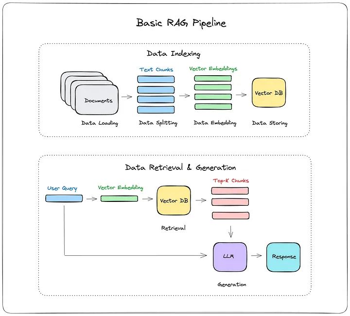

# rag_assignment
An implementation of RAG

Please follow below command to run the app in docker

1. docker build . -t lala/streamlitbuild
2. docker image ls
3. docker run -p 8501:8501 <IMAGE ID>

## RAG Architecture

## Issues and Improvements of existing application

1. Reranking: A high score in vector similarity search does not mean that it will always have the highest relevance. Reranking retrieval results before sending them to the LLM has significantly improved RAG performance.

2. Guardrails: Guardrails are safety mechanisms offering guidelines and boundaries to ensure that AI applications are being developed and aligned to meet ethical standards and societal expectations.

3. hallucination: An LLM hallucination occurs when a large language model (LLM) generates a response that is either factually incorrect, nonsensical, or disconnected from the input prompt. Hallucinations are a byproduct of the probabilistic nature of language models, which generate responses based on patterns learned from vast datasets rather than factual understanding. Playing around with prompts to address LLM hallucinations.

